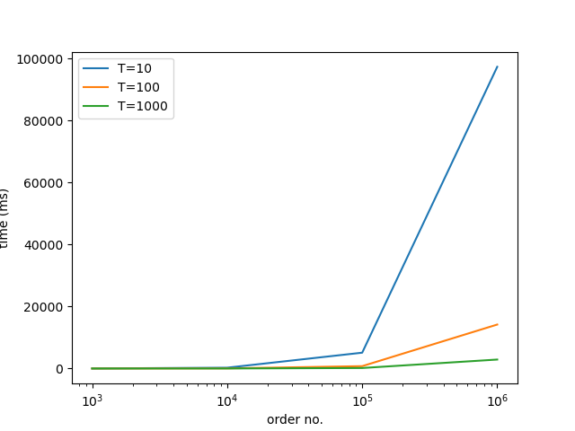

# MOP
Market Order Processer (MOP) is a dummy project. It implements the class OrderBook which acts as a market order book. It
* stores the current status for buy/sell orders including: 
    * order id
    * ticker/product code
    * bidding/asking price
    * order size
* implements a method to process new order
* implements a method to retrieve the best (lower) asking and best (higher) bid price at any given time.

The orders are read in string format and a feeder mocker has been inplemented in the test folder.
The following assumptions hold:
* the orders arrive in chronological order. It doesn't happen that at second 15 the feeder produces a new order related to second 5. This is because if best ask and bid prices are requested at second 10, the results might be wrong
* the orders make sense. No cancel order can arrive for an order id that was never added. Same holds for update orders. 

MOP is based on the boost libraries (http://boost.org) for testing, multi-indexed containers, timers and more. 
MOP also uses the OpenMP library (https://www.openmp.org/) to handle the four threads that constitute the system. 

## What it does
MOP implements the classes MarketData and OrderBook which provide the following interface.

### MarketData
    static boost::shared_ptr<MarketData> fromStr(std::istream & in)
build a MarketData object from string.

### OrderBook
    bool empty()
returns the book status

    void processOrder(boost::shared_ptr<MarketData> const& md)
process an order as described by MarketData

    boost::tuple<double, double> getBestAskAndBid(std::string const& ticker)
returns a tuple with the best <ask,bid> prices for the ticker. In case not in bid/ask returns 0 only for that branch.

    double getPriceFor(std::string const& id)
    std::uint32_t getSizeFor(std::string const& id)
utility interfaces, written for testing purposes
## How it does
MOP implements two multi_indexed data structures (one for bids, one for asks) to keep track of orders status. 
Orders in each structure are sorted by:
* id
* ticker
* price
* ticker_and_price
This last point allows for a quick retrieval of the best asking/bidding price for each ticker

## Is it fast?
Some benchmarking was carried out. It can consume 1000000 orders checking for the best prices every 10 in approximatively 100000 milliseconds.
This sums up to 1000000 processOrder() calls and 202500000 getBestAskAndBid() calls (2025 different tickers).
My goal was process o(1.e5) orders in a day, with 86400 * nTickers calls to getBestAskAndBid().
With this in mind, it is fast for the initial goal.

In the Benchmark chart above, T represents the "period" (how many iteration) between two subsequent sets of 2025 calls of getBestAskAndBid().
The x-axis (note it is in log scale) represents the total number of processed orders for a certain run, while the execution time is reported on the y-axis.
## Is it tested? 
The logic is tested. 
to build/test the program use
    
    mkdir build
    cd build
    cmake ..
    make
    ctest

## What is missing? 
A little order generator mocker is provided. The whole system works on its own. 
As stated before, this is a dummy project. Better interface with data-feeder and IO could/should be implemented.

## What is good? 
The system is easly mantainable/extendable. The usage of boost_multi_index containers allows for great flexibility.

## System example
In main.cpp the "library" usage is shown. With openmp it creates four threads:
* The **interface** reads ticker name of interest from the standard input and eventually triggers the program termination
* The **feeder** generates random (but correct in both syntax and logic) orders and add them to an order queue
* The **bookkeeper** processes the orders from the queue FIFO
* The **inquirer** reads user input and provides best ask and bid prices for that ticker once per second

# usage
I do use this system with two terminals.
1. $>./mop 2>log.txt # this runs the system and accept user commands
2. $>tail -f log.txt # this print on screen the best ask and bid prices for the ticker of interes